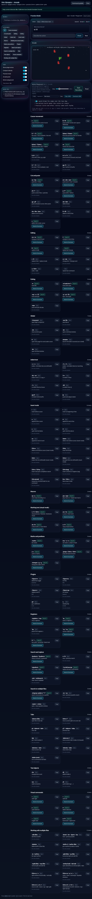

# Vim Olympics Arcade & Tutor 🕹️📗

[](https://vitejs.dev/)
[](https://react.dev/)
[](https://phaser.io/)
[](https://tailwindcss.com/)
[](https://github.com/SteveFreeBSD/vim-olympics-arcade/actions/workflows/ci.yml)

## Preview



An **interactive Vim learning app** with two personalities:

- **Tutor**: a clean, focused practice environment (playground, commands, quizzes).
- **Arcade**: a Defender‑style mini‑game controlled with Vim‑like keys.

Built with **React + Vite + TailwindCSS** for UI and **Phaser 3** for the arcade panel.

Live demo (GitHub Pages):
https://stevefreebsd.github.io/vim-olympics-arcade/

---

## 📦 What’s in the app

### 1) Motion Playground (src/components/Playground.jsx)

A text buffer you can move around with Vim motions. Great for habit‑building.

- Keys: `h j k l`, `0`, `$`, `w`, `b`, `e`, `ge`, `gg`, `G`, `x`, `u`
- Goals panel & sample buffers
- Copy‑to‑clipboard and reset helpers

### 2) Lessons & Command Cards (CommandCard / CommandModal / CommandPalette)

Self‑contained cards that teach a motion or command with examples.

- “Load in Playground” pipes example text into the Playground
- Palette lets you search by motion (e.g., type `dw`, `cw`, `gg`)
- Modal shows description, examples, and tips

### 3) Quiz (src/components/Quiz.jsx)

Small, focused checks to reinforce a concept.

- Multiple‑choice or “type the command” formats
- Pulls examples from the same lesson data

### 4) Arcade Panel (Phaser) (ArcadePanel + GameScene)

A small canvas embedded in the app for game‑feel practice.

- Vim‑shaped starship, dual‑gun firepoints
- Enemies spawn, drift, and collide; score + timer HUD
- Wave progression: Wave 1→4 require 3/4/5/6 letter kills; Wave 5 spawns the Emacs boss; Wave 6+ are letters‑only with higher aggression
- Emacs boss: rotating sprite, fan‑pattern bullets, tuned difficulty
- Synth audio SFX (WebAudio). Click once to enable; press `m` to mute
- High scores: initials entry on new high, scoreboard overlay
- Keys: `h/l` strafe, `j` thrust, `k` brake, `x` fire, `f<char>` lock‑on, `w/b` dash

### 5) Glue & Safety (ErrorBoundary / DebugBanner)

- ErrorBoundary keeps one bad component from crashing the page
- DebugBanner helps toggle dev/test flags

---

## 🗂️ Project structure (high‑level)

```
src/
  components/
    ArcadePanel.jsx        # Phaser mount + scene bootstrap
    CommandCard.jsx        # Lesson card UI
    CommandModal.jsx       # Lesson detail + “Load in Playground”
    CommandPalette.jsx     # Quick find by command
    Playground.jsx         # Text buffer + motions
    Quiz.jsx               # Lightweight quiz engine
    Header.jsx, Stars.jsx  # UI chrome
    CopyButton.jsx, Pill.jsx, Toggle.jsx  # small UI atoms
  App.jsx
  main.jsx
index.html
tailwind.config.cjs
postcss.config.cjs
vite.config.js
ARCHITECTURE.md
CHANGELOG.md
```

---

## 🛠️ Getting started

```bash
npm install
npm run dev
```

Build for production:

```bash
npm run build
```

Run tests:

```bash
npm test
```

Code quality:

```bash
npm run lint     # ESLint (flat config)
npm run format   # Prettier
```

If you prefer Docker or a different Node version, Vite is happiest on Node 18+. See `.nvmrc` for a suggested LTS.

---

## 🎮 Default controls

**Playground**

- `h j k l` move • `0` / `$` line start/end
- `w b e ge` word motions • `gg` / `G` buffer start/end
- `x` delete char • `u` undo • `i`/`Esc` insert mode
- `a/A/I/o/O` insert variants • `Enter` newline

**Arcade**

- `h/l` strafe • `j` thrust • `k` brake
- `x` fire (dual guns)
- `f<char>` lock‑on • `w/b` dash (double‑tap `w`)
- `m` mute SFX • `?` help overlay
- High scores: new highs prompt for initials; press `S` for leaderboard; `R` to retry on Game Over

Palette helpers:

- `Mark Visible Done` and `Unmark Visible` to quickly flag lessons.

Click the arcade panel once to focus its keys.

---

## 🎨 Styling & tech notes

- **TailwindCSS** for utility‑first styling (`index.css`, `tailwind.config.cjs`)
- **Phaser 3** for arcade physics & particles
- **Audio**: lightweight synthesized SFX via WebAudio (no assets). A small hint prompts you to click/press once to unlock sound.
- **Responsive Arcade**: Phaser panel scales to fit its container and centers.
- **Reduced Motion**: respects `prefers-reduced-motion` to tone down FX and camera shake; pauses on tab blur.
- **ESLint (flat) + Prettier**: `npm run lint` and `npm run format` available
- **Architecture**: see `ARCHITECTURE.md` for scene structure, collisions, and wave logic

---

## 🤝 Contributing (or just organizing your own work)

1. Create a branch: `git switch -c feat/<short-name>`
2. Keep changes small; run `npm run build` before pushing
3. Open a PR with a short description and a checkbox list of what changed

Suggested labels: `feature`, `bug`, `docs`, `ui`, `gameplay`.

See CONTRIBUTING.md for full guidelines. CI runs tests and build on PRs.

Deploy to GitHub Pages (GitHub Actions):

- Enable Pages: Settings → Pages → Build and deployment → Source: GitHub Actions.
- Push to `main` (or use “Run workflow” in Actions). The Deploy Pages workflow builds, tests, and publishes `dist`.
  Note: `vite.config.js` `base` is set to `/vim-olympics-arcade/` for this repo.

---

## 🧭 Roadmap (next slices)

- Insert mode toggle in Playground (`i` / `Esc`)
- More motions: text objects, `d/y/c` operators
- Lesson progress & badges (Stars)
- Arcade: music layer, balance pass, extra enemy types
- Export lessons as a printable cheat sheet

---

## 🆘 Troubleshooting

- **Keys don’t work in Arcade** → click the arcade panel to focus; ensure dev server isn’t trapping keys in another tab.
- **No sound** → interact once (click or key) to unlock WebAudio; press `m` to toggle mute. Some browsers block audio until user gesture
- **Build errors** → check the exact file:line Vite prints; run `npx prettier . --write` to fix formatting.
- **Push fails** → ensure SSH agent is loaded:
  ```bash
  eval "$(ssh-agent -s)" && ssh-add ~/.ssh/id_ed25519
  ```

---

## 📄 License

MIT © 2025 Steven Robinson

---

## 📜 Changelog

See `CHANGELOG.md` for release notes. We follow semver; notable gameplay changes in 1.1.0:

- Wave thresholds (3/4/5/6) and Emacs boss on wave 5
- Lock‑on + dash, synthesised SFX, high scores overlay
